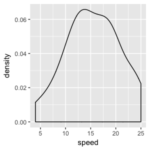
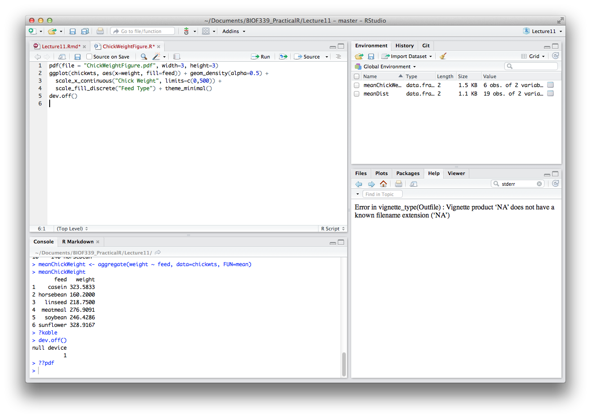

```{r setup, include=FALSE}
knitr::opts_chunk$set(echo = TRUE)
```

## Considerations for publication graphics

- Font size
- Graphics file format
- Resolution
- Error bars
- Requirements frequently change between journals

## File Formats

In general, you will generate a graphics file for your plot by calling a function which will have the same name as the desired file format (svg, pdf, jpeg, etc).

```{r}
library(ggplot2, quietly = TRUE)
svg(filename="myPlot.svg", width = 3, height=3, pointsize = 8)
ggplot(cars, aes(x=speed)) + geom_density()
dev.off()
```
The second command opens a file for output, the third geneates the plot, and the fourth command (dev.off()) finishes writing the file and closes it.  By default, graphics go to the last graphics "device" you created and dev.off closes the last graphics device created.

## Vector Graphics

Conventional graphics files store a pixel by pixel representation of an image.  In contrast, vector graphics formats like SVG and PDF store instructions to generate the image, like "draw a line from coordinates (2,3) to (-5,10)".  For many graphs, this means a smaller file size and images that can be scaled without looking rough and pixelated.

Because vector graphics are instructions and not pixels, they do not have a "resolution".

Probably no reason to use SVG instead of PDF, since PDF is more widely supported.

## Vector versus Raster (pixel) graphics

```{r}
pdf(file = "test.pdf", width=3, height=3)
ggplot(cars, aes(x=speed)) + geom_density()
dev.off()
png(filename = "test.png", width=3, height=3, units = "in",res = 100)
ggplot(cars, aes(x=speed)) + geom_density()
dev.off()
```

## Vector Graphics Example

<embed src="test.pdf" width="500px" height="500px" />

## Raster Graphics Example

```{r, out.width = "500px", echo=FALSE}

```

## File Size

test.pdf: 9KB
test.png: 16KB

Raster graphics take more space but give worse results!  In general, you will be better off using vector graphcics when makeing plots and graphs.

## Error Bars

You create error bars in ggplot by adding an extra plot argument, geom_errorbar.  You specify the top and bottom "y" position of the error bar, and optionally the width.  You will have to calculate where the error bars should be and choose what they should represent (standard deviation, standard error, 95% confidence interval).

## Calculating Standard Error

A standard method to achieve error bars would be to calculate standard error (using apply or aggregate), and store the value in a column.  
Be careful!  There is a standard error function in R (stderr) that has nothing to do with standard errors!  But you can define your on function to calculate it or use a package that supplies the standard error function. 
 
```{r}
se <- function(x) sqrt(var(x)/length(x))
meanDist <- aggregate(dist ~ speed, data=cars, FUN=mean)
seDist <- aggregate(dist ~ speed, data=cars, FUN=se)
meanDist$se <- seDist[,2]
```

## Error Bar Example

```{r}
ggplot(meanDist, aes(x=speed, y=dist)) + geom_bar(stat="identity") +
  geom_errorbar(aes(ymin=dist - se, ymax=dist+se))
```

## Missing Error Bars?

```{r}
seDist[1:10,]
```

## Adjusting factor ordering

If you are plotting a factor, you can determine the order that ggplot arranges things by changing the order of the factor

 
```{r fig.height=4,fig.width=7}
ggplot(chickwts, aes(x=feed, y=weight)) + geom_boxplot()
```

## Ordering Chick Feeds

```{r}
library(knitr, quietly = TRUE)
meanChickWeight <- aggregate(weight ~ feed, data=chickwts, FUN=mean)
kable(meanChickWeight, format = "markdown")
```

## Finding the right order

```{r}
feedOrder <- meanChickWeight$feed[order(meanChickWeight$weight)]
feedOrder
as.character(feedOrder)
```

## Changing the factor order

```{r, fig.height=4, fig.width=7}
chickwts$feed <- factor(chickwts$feed, levels = as.character(feedOrder))
ggplot(chickwts, aes(x=feed, y=weight)) + geom_boxplot()
```

## Changing the axis title

```{r, fig.height=4, fig.width=7}
ggplot(chickwts, aes(x=feed, y=weight)) + geom_boxplot() + 
  scale_y_continuous("Chick Weight") + scale_x_discrete("Feed Type")
```

## Changing the axis limits

```{r, fig.height=4, fig.width=7}
ggplot(chickwts, aes(x=feed, y=weight)) + geom_boxplot() + 
  scale_y_continuous("Chick Weight", limits=c(0,500)) +
  scale_x_discrete("Feed Type")
```

## Log scale

```{r, fig.height=4, fig.width=7}
ggplot(chickwts, aes(x=feed, y=weight)) + geom_boxplot() + 
  scale_y_log10("Chick Weight", limits=c(10,500)) +
  scale_x_discrete("Feed Type")
```

## Coloring of Factors

```{r, fig.height=4, fig.width=7}
ggplot(chickwts, aes(x=weight, fill=feed)) + geom_density(alpha=0.5) + 
  scale_x_continuous("Chick Weight", limits=c(0,500))
```

## Manual Color Scale

```{r, fig.height=4, fig.width=7}
ggplot(chickwts, aes(x=weight, fill=feed)) + geom_density(alpha=0.5) + 
  scale_x_continuous("Chick Weight", limits=c(0,500)) +
  scale_fill_manual("Feed Type",values = c("red","orange","yellow","green","blue","violet"))
```

## Fill Color Brewer

```{r, fig.height=4, fig.width=7}
ggplot(chickwts, aes(x=weight, fill=feed)) + geom_density(alpha=0.5) + 
  scale_x_continuous("Chick Weight", limits=c(0,500)) +
  scale_fill_brewer("Feed Type")
```

## Fill Color Brewer

```{r, fig.height=4, fig.width=7}
ggplot(chickwts, aes(x=weight, fill=feed)) + geom_density(alpha=0.5) + 
  scale_x_continuous("Chick Weight", limits=c(0,500)) +
  scale_fill_grey("Feed Type")
```

## Changing Plot "Theme"

```{r, fig.height=4, fig.width=7}
ggplot(chickwts, aes(x=weight, fill=feed)) + geom_density(alpha=0.5) + 
  scale_x_continuous("Chick Weight", limits=c(0,500)) +
  scale_fill_discrete("Feed Type") + theme_bw()
```

## Minimal Theme

```{r, fig.height=4, fig.width=7}
ggplot(chickwts, aes(x=weight, fill=feed)) + geom_density(alpha=0.5) + 
  scale_x_continuous("Chick Weight", limits=c(0,500)) +
  scale_fill_discrete("Feed Type") + theme_minimal()
```

## Graph Refinement

Chances are that you will continue to refine your graph during the manuscript process.  Make the code for each graph a separate "R script", so that it is easy to:

- Make changes
- Regenerate the graph
- See what data and commands were used to generate each graph
- Cut and paste for similar work later

## Example Script

```{r, out.width = "700px", echo=FALSE}

```

## Multiple Graphs

Although "facets" provides a means to put lots of related plots side by side, it is more typical in a paper to have many plots as one part of a figure.  While there are ways of breaking up the plot space in R, I would recommend against trying to do this for publication graphs.  Control of margins and other factors becomes too difficult.

## Workflow for Multi-Part Figures

- Generate each graph separately to a PDF
- Import into Adobe Illustrator
- Arrange figure parts appropriately
- Export in required file format and resolution

The great thing about PDFs is that the "text" can be modified, changing font style and size as required by journal.  If your lab won't buy you an Adobe Illustrator license, try using "Inkscape", a free alternative.

## Final Presentations

I would like to suggest that everyone send their final presentation to me as a "pdf" file, with the file name being "LastFirst.pdf" (for example "BuehlerEugen.pdf").  This will make it easy to order the files into a single presentation.

Two hours is not a lot of time for so many people to present, so there may be only ~10 minutes per person for presentations.  It is OK to add slides that you want us to see but that you have to skip over for time.

## Final Presentation Contents

Should include the following five elements, demonstrating the code and the results of the code to

<OL>
<LI>Use a package not loaded by default in the base distribution
<LI>Read in a data set from a file
<LI>Manipulate the data in some way
<LI>Do a statistical test of the data
<LI>Make a graph from the data
</OL>

The material doesn't have to be presented in that order, and could include more (data background, more than one graph or statistical test, etc).  Your grade will be determined based on how many of the five requirements your demonstrate (in your slides).

## Grading Scheme

<UL>
<LI>A = All five elements demonstrated
<LI>B = Four elements demonstrated
<LI>C = Three elements demonstrated
<LI>D = Two elements demonstrated
<LI>F = One or zero elements demonstrated
</UL>