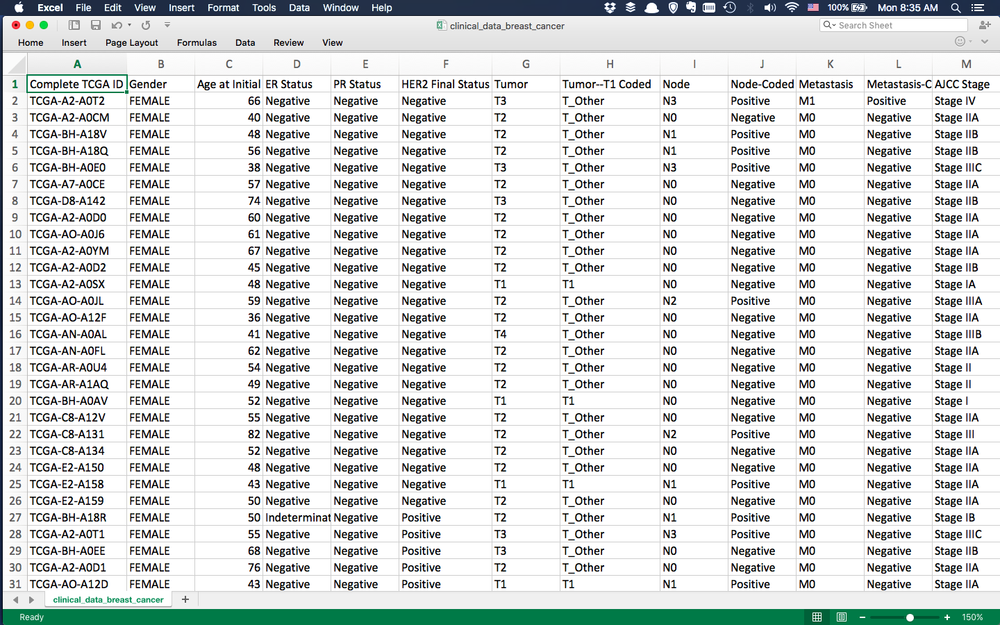
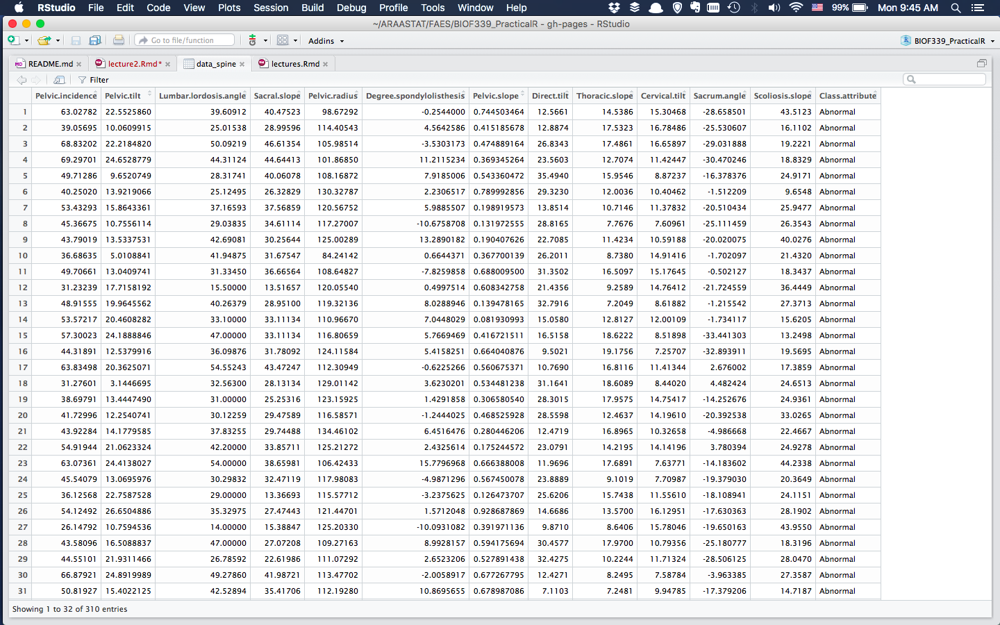

# Preamble

# Practice makes perfect

+ Start using [RSeek](http://www.rseek.org) 
+ Other resources on website [http://www.araastat.com/BIOF339_PracticalR](http://www.araastat.com/BIOF339_PracticalR)
+ Beg, Borrow, Steal code that you need 
    
    + R is open-source, so is meant to be shared

# R coding conventions
```{r}
# This is a comment, which doesn't get evaluated

1:3 # This is also a comment

# Multi-line code

x <- c(1, 2, 
       3, 4, 5, 6,
       7)
x
```

Google has a <a href="https://google.github.io/styleguide/Rguide.xml" target="_blank">style guide</a> for
how to write R code

# R packages

R packages live on [CRAN](http://cran.r-project.org) and its mirrors. To install
an R package:
```{r, eval=FALSE}
install.packages('dplyr', repos='http://cran.r-project.org')
```
or
```{r}
knitr::include_graphics('lecture2_img/install_package.png')
```


# R Packages

To use a package, or rather, use the functions from the package, you have to load it into R

```{r, eval=FALSE}
library(dplyr)
```
We'll talk about packages later in the semester. 

We will 
concentrate now on what is known as __Base R__, that is, the functions that are available
when R is installed

# Loading data

We will usually load CSV files, since they are the easiest for R. The typical suggestion if you 
have Excel data is to save the sheet as a CSV and then import it into R. 

> You can 
  also load Excel files directly using either the `readxl` or `rio` packages

# The structure of data sets

# Tables
+ Data is typically in a rectangular format
  
    + spreadsheet, database table
    + CSV (comma-separated values) or TSV (tab-separated values) files

+ Characteristic
  
    + Rows are observations
    + Columns are variables
    + Each column has the same number of observations

> [__Tidy data__](https://cran.r-project.org/web/packages/tidyr/vignettes/tidy-data.html) is a particularly amenable format for data analysis. 
  
#

```{r, echo=F}
knitr::include_graphics('lecture2_img/spreadsheet3.png')
```

<div style="font-size:small; text-align="center">
An example [GEO](http://www.ncbi.nlm.nih.gov/geo/) dataset
</div>

#
```{r, echo=F}
knitr::include_graphics('lecture2_img/spreadsheet2.png')
```
<div style="font-size:small;text-align:center;">
[Lower back pain symptoms dataset](https://www.kaggle.com/sammy123/lower-back-pain-symptoms-dataset) on _Kaggle.com_
</div>

# 
```{r, echo=F}

```
<div style="font-size:small;text-align:center;">
[Breast Cancer Proteome dataset](https://www.kaggle.com/piotrgrabo/breastcancerproteomes) on _Kaggle.com_
</div>

# Let's look at a dataset
```{r, echo=F}
knitr::include_graphics('lecture2_img/spreadsheet2.png')
```


# Let's look at a dataset

```{r}
data_spine <- read.csv('lecture2_data/Dataset_spine.csv')
```

```{r}
head(data_spine)
```

<div style="font-size:small">
Ignore the first `##`; it denotes that this is R output
</div>

# Let's look at a dataset

+ Assumes that the first row has variable names
+ Replaces spaces with .
+ Keeps numeric and character variables together

# Let's look at a dataset

```{r, eval=FALSE}
View(data_spine)  ## It looks like a matrix
```
```{r}

```


# Let's look at a dataset

```{r}
str(data_spine) ## Structure of a dataset
```

<div style="font-size:small">
So this is a `data.frame` object with `r nrow(data_spine)` observations and 
`r ncol(data_spine)` variables, of which one is a __factor__ and the rest are __numeric__
</div>
It looks like a __list of things__

# Dataframes

Dataframes are the primary mode of storing datasets in R

They were revolutionary in that they kept heterogeneous data together

They share properties of both a __matrix__ and a __list__

```{r}
class(data_spine)
```

> Technically, a data.frame is a list of vectors (or objects, generally) of the same length  

# Matrices

A __matrix__ is a rectangular array of data _of the same type_

```{r}
matrix(0, nrow=2, ncol=4)
```
```{r}
matrix(letters, nrow=2)
```
```{r}
matrix(letters, nrow=2, byrow=T)
```

# Matrices

You can create a matrix from a set of _vectors_ of the same length
```{r}
x <- c(1,2,3,4)
y <- c(10,20,30,40)
```
Put columns together
```{r}
cbind(c(1,2,3,4), c(10,20,30,40)) ## Column bind
```

# Matrices

You can create a matrix from a set of _vectors_ of the same length
```{r}
x <- c(1,2,3,4)
y <- c(10,20,30,40)
```
Put rows together
```{r}
example_matrix <- rbind(c(1,2,3,4), c(10,20,30,40)) ## Row bind
example_matrix
```

# Extracting elements

```{r}
example_matrix 
example_matrix[1,] ## Extracts 1st row
example_matrix[,2:3] ## extracts 2nd & 3rd columns
example_matrix[1,4]
```

# Matrix properties
```{r}
example_matrix
nrow(example_matrix) ## Number of rows
ncol(example_matrix) ## Number of columns
dim(example_matrix) ## shortcut for above
```

# Matrix arithmetic
```{r}
example_matrix
example_matrix + 5 ## Add 5 to each element
example_matrix * 2 ## Multiply each element by 2
```

# Two matrices
```{r}
example_matrix
example_matrix2 <- rbind(3:6, 9:12)
example_matrix2
example_matrix + example_matrix2
```
# Two matrices
```{r}
example_matrix
example_matrix2
example_matrix * example_matrix2 ## Not matrix multiplication, but element-wise multiplication
```

# Two matrices
```{r}
rbind(example_matrix, example_matrix2)
cbind(example_matrix, example_matrix2)
```
# Two matrices
```{r}
dim(example_matrix2)
t(example_matrix2) ## Transpose of a matrix
example_matrix %*% t(example_matrix2) ## Matrix multiplication
```

# Lists

Lists are collections of arbitrary objects in R
```{r}
example_list <- list(c('Andy','Brian','Harry'), 
                     c(12, 16, 16), 
                     c(TRUE, TRUE, FALSE), 
                     matrix(1, nrow=2, ncol=3))
example_list
```

# Extracting elements from lists
```{r}
example_list[[3]]
```
```{r}
example_list[1:2]
```

# Extracting elements from lists
```{r}
example_list[[4]]
class(example_list[[4]])
example_list[[4]][1,]
```

# Named lists
```{r}
example_named_list <- list('Names' = c('Andy','Brian','Harry'), 
                     "YearsOfEducation" = c(12, 16, 16), 
                     "Married" = c(TRUE, TRUE, FALSE), 
                     'something' = matrix(1, nrow=2, ncol=3))

example_named_list[['Names']]
example_named_list$Names
example_named_list$Names[3]
```

# Back to a Data Frame

A data.frame object is a __named list__ where each element is of the same length

You can use both _matrix_ and _list_ functions to operate on data.frame objects!!

# Data Frames
```{r}
head(data_spine)
```
# Data Frames
```{r}
dim(data_spine)
nrow(data_spine)

data_spine_small <- data_spine[1:4,] ## Matrix operation
```

# Data Frames
```{r}
data_spine_small[,2] ## Matrix extraction by position
data_spine_small[[2]] ## List extraction by position
```

# Data Frames
```{r}
data_spine_small[['Pelvic.tilt']] ## Named list extraction
data_spine_small[,'Pelvic.tilt'] ## Data frame named column extraction
data_spine_small$Pelvic.tilt ## Dollar sign extraction
```

# Data Frames

My preference is for

1. _data frame named column extraction_ `data_spine_small[,'Pelvic.tilt']`, 
2. _named list extraction_ `data_spine_small[['Pelvic.tilt']]`
3. _Dollar-based extraction_ `data_spine_small$Pelvic.tilt`


# Data Frames
```{r}
names(data_spine_small)

data_spine_small[,c('Pelvic.tilt', 'Pelvic.slope','Class.attribute')]
```

# Filtering data frames

### Boolean operators

Operator     |  Meaning
-------------|----------
 `|`         |  Or                                      
 `&`         |  And                                     
 `!`         |  Not                                     

# Filtering data frames

```{r}
data_spine[data_spine$Pelvic.tilt > 20, ]
```

```{r, eval=F}
subset(data_spine, Pelvic.tilt > 20) ## is equivalent
```

# Filtering data frames
```{r}
data_spine[data_spine$Pelvic.tilt > 20 & data_spine$Pelvic.slope > 0.85, ]
```
```{r, eval=FALSE}
subset(data_spine, Pelvic.tilt > 20 & Pelvic.slope > 0.85)
```

# Filtering data frames and selecting variables
```{r}
data_spine[data_spine$Pelvic.tilt > 20 & data_spine$Pelvic.slope > 0.85, 
           c('Direct.tilt', 'Class.attribute')]
```


# Adding a variable
```{r}
data_spine_small[,'bad.angle'] <- c('No','Yes','No','No')
data_spine_small
```
```{r, eval=F}
data_spine_small$bad.angle <- ...
data_spine_small[['bad.angle']] <- ...
```

# Removing a variable
```{r, eval=FALSE}
data_spine_small[, -c(13,14)]

data_spine_small[,-c('Class.attribute', 'bad.angle')]

## The next two commands change the original data set

data_spine_small[c('Class.attribute','bad.angle')] <- NULL

data_spine_small[['bad.angle']] <- NULL
```

# Creating derived variables
```{r}
data_spine_small$bad.angle <- ifelse(data_spine_small$Sacrum.angle > 80, 
                                     'Yes','No')
```

# Creating derived variables
```{r}
data_spine_small <- transform(data_spine_small, 
                              bad.angle = ifelse(Sacrum.angle > 80, 
                                                 'Yes','No'))
```

# For deriving multiple variables into a data frame
```{r}
head(mtcars)
```

# For deriving multiple variables into a data frame

```{r}
mtcars <- transform(mtcars, 
                    kmpg = mpg * 1.6, ## Numerical vector
                    low.mpg = ifelse(mpg < 16, 'Yes','No')  ## Factor
                    )
```

# For deriving multiple variables into a data frame
```{r}
str(mtcars)
```

# Adding new data to a data frame

You can concatenate two data frames using `rbind` as long as the variable names 
and orders are the same
```{r}
new_data = rbind(data_spine[1:4,], data_spine[c(8,22),])
new_data
```

# Adding new data to a data frame
You can add columns of a new data frame to an existing data frame using `cbind` as long as
the columns have no common names 
```{r}
new_data2 <- cbind(data_spine[1:4, c('Pelvic.slope','Class.attribute')], 
                   data.frame(Sex = c('M','F','M','M'),    ## Creating a new data frame on the fly
                              Race = c('W','B','As','B'))
                   )
new_data2
```


