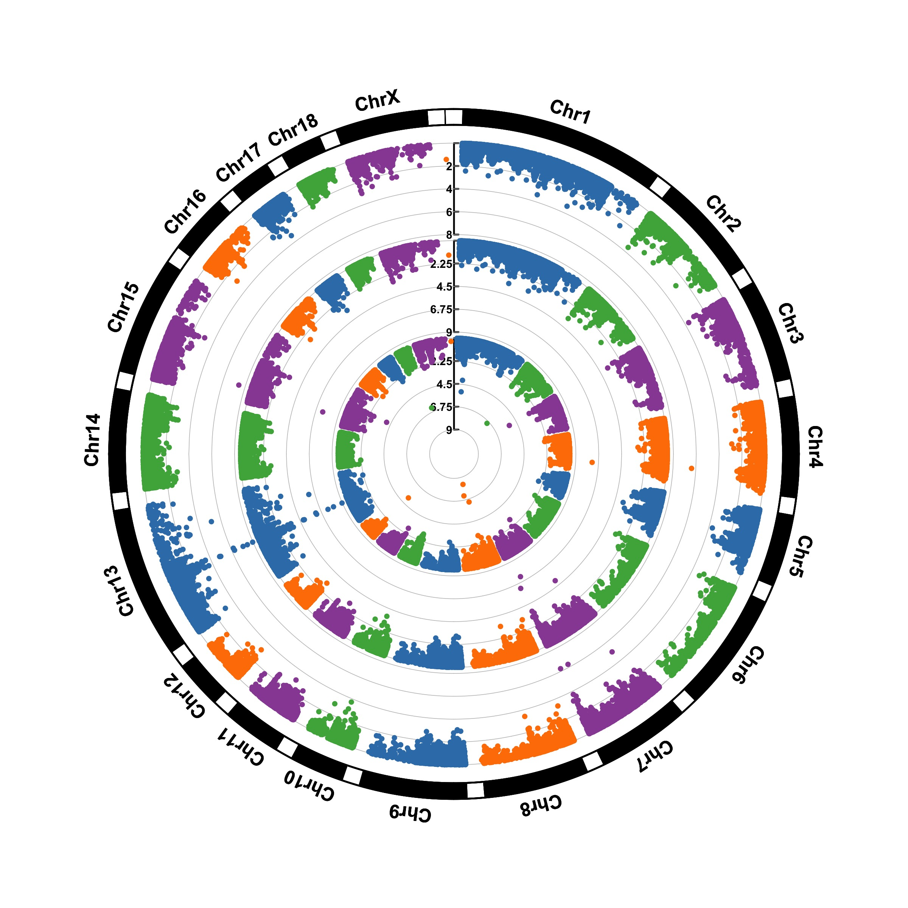

```{r setup, include=FALSE}
knitr::opts_chunk$set(echo = TRUE,
                      #fig.width = 4,
                      #fig.height = 4,
                      comment = '#  ',
                      cache = T,
                      message = F,
                      warning = F,
                      out.height="500px")
library(tidyverse)
library(htmlwidgets)
library(leaflet)
library(plotly)
theme_set(theme_grey())
```

# Data Visualization in R

## Gallery

```{r, echo = F, fig.align='center'}
# install.packages('ggpubr')
library(ggpubr)
data("ToothGrowth")
df <- ToothGrowth
p <- ggboxplot(df, x = "dose", y = "len",
                color = "dose", palette =c("#00AFBB", "#E7B800", "#FC4E07"),
                add = "jitter", shape = "dose")
my_comparisons <- list( c("0.5", "1"), c("1", "2"), c("0.5", "2") )
p + stat_compare_means(comparisons = my_comparisons)+ # Add pairwise comparisons p-value
  stat_compare_means(label.y = 50)
detach('package:ggpubr')
```


## Gallery

```{r, echo = F, fig.align = 'center'}
# install.packages('cowplot')
library(cowplot)
p1 <- ggplot(iris, aes(Sepal.Length, Sepal.Width, color = Species)) + 
  geom_point() + facet_grid(. ~ Species) + stat_smooth(method = "lm") +
  background_grid(major = 'y', minor = "none") + 
  panel_border() + theme(legend.position = "none")

# plot B
p2 <- ggplot(iris, aes(Sepal.Length, fill = Species)) +
  geom_density(alpha = .7) + theme(legend.justification = "top")
p2a <- p2 + theme(legend.position = "none")

# plot C
p3 <- ggplot(iris, aes(Sepal.Width, fill = Species)) +
  geom_density(alpha = .7) + theme(legend.position = "none")

# legend
legend <- get_legend(p2)

# align all plots vertically
plots <- align_plots(p1, p2a, p3, align = 'v', axis = 'l')

# put together bottom row and then everything
bottom_row <- plot_grid(plots[[2]], plots[[3]], legend, labels = c("B", "C"), rel_widths = c(1, 1, .3), nrow = 1)
plot_grid(plots[[1]], bottom_row, labels = c("A"), ncol = 1)

detach('package:cowplot')
```

## Gallery

```{r, echo = F, fig.align="center"}
# library
library(ggridges)
library(ggplot2)
 

# basic example
ggplot(diamonds, aes(x = price, y = cut, fill = cut)) +
  geom_density_ridges() +
  theme_ridges() + 
  theme(legend.position = "none")
```

## Gallery

### Manhattan plot
```{r, echo = F, fig.align="center", out.height = "500px", out.width="600px", message = F}
library(qqman)
manhattan(gwasResults, annotatePval = 0.01)

detach('package:qqman')
```


## Gallery

### Circular Manhattan plot

```{r, echo = F, results = 'hide', message = F, warning=F, out.width="500px", fig.align='center'}
#install.packages('CMplot')
library(CMplot)
data(pig60K)
CMplot(pig60K, plot.type="c", chr.labels=paste("Chr",c(1:18,"X"),sep=""), r=0.4, cir.legend=TRUE,
        outward=FALSE, cir.legend.col="black", cir.chr.h=1.3 ,chr.den.col="black", file="jpg",
        memo="", dpi=300)
detach('package:CMplot')
```
```{r, echo = F, out.width="500px" ,fig.align = "center"}

```

## Gallery

### Maps

```{r, echo = F, out.height="500px", fig.align='center'}
library(choroplethr)
data(df_pop_county)
county_choropleth(df_pop_county,
                  title="US 2012 County Population Estimates",
                  legend = "Population")
detach('package:choroplethr')
```

## Gallery

### Interactive graphs

```{r,  echo=F, fig.align='center', out.height="500px"}
p=ggplot(iris, aes(x=Sepal.Length, y=Sepal.Width, color=Species, shape=Species)) + 
    geom_point(size=6, alpha=0.6)
mytext=paste("Sepal Length = ", iris$Sepal.Length, "\n" , "Sepal Width = ", iris$Sepal.Width, "\n", "Row Number: ",rownames(iris),  sep="")    
pp=plotly_build(p)   
style( pp, text=mytext, hoverinfo = "text", traces = c(1, 2, 3) )
# ggplotly(p)
```


## Gallery 

### Interactive graphs

```{r, echo=F, out.height="500px" }
library(dygraphs)
library(xts)          # To make the convertion data-frame / xts format
 
# Create data + verify it is date format + change them to xts format:
data=data.frame(time=seq(from=Sys.Date()-40, to=Sys.Date(), by=1 ), value=runif(41))
str(data$time)
data=xts(x = data$value, order.by = data$time)
 
# Default = line plot --> See chart #316
 
# Add points
dygraph(data) %>%
  dyOptions( stemPlot = TRUE)
```

## Gallery

### Animation

```{r, echo = F, eval=T}
# devtools::install_github('thomasp85/gganimate')
library(gganimate)
library(gapminder)

ggplot(gapminder, aes(gdpPercap, lifeExp, size = pop, colour = country)) +
  geom_point(alpha = 0.7, show.legend = FALSE) +
  scale_colour_manual(values = country_colors) +
  scale_size(range = c(2, 12)) +
  scale_x_log10() +
  facet_wrap(~continent) +
  # Here comes the gganimate specific bits
  labs(title = 'Year: {frame_time}', x = 'GDP per capita', y = 'life expectancy') +
  transition_time(year) +
  ease_aes('linear')
detach('package:gganimate')
```

# ggplot2

## 

We're making the decision to use `ggplot2` for my graphics

+ Makes pretty good formatting choices out of the box
+ Works like pipes!!
+ Is declarative (tell it what you want) without getting caught up in minutae
+ Strongly leverages data frames (good practice)
+ Fast enough
+ There are good templates if you want to change the look

## Introduction to ggplot2

```{r, echo=c(1,2)}
# install.packages('tidyverse')
library(ggplot2)
theme_set(theme_grey())
```

## Introduction to ggplot2

The `ggplot2` package is a very flexible and (to me) intuitive way of visualizing data.
It is based on the concept of layering elements on a canvas.

> This idea of layering graphics on a canvas is, to me, a nice way of building graphs

## Introduction to ggplot2

You need:

+ A `data.frame` object
+ _Aesthetic mappings_ (aes) to say what data is used for what purpose in the viz
    + x- and y-direction
    + shapes, colors, lines
+ A _geometry object_ (geom) to say what to draw
    + You can "layer" geoms on each other to build plots
    

## Introduction to ggplot2

`ggplot` used pipes before pipes were a thing. However, it uses the `+` symbol for
piping rather than the `%>%` operator, since it pre-dates the `tidyverse`

## Introduction to ggplot2

```{r, eval=F}
library(ggplot2)
ggplot(mtcars, aes(x = wt, y = mpg)) + geom_point()
```

+ A `data.frame` object: mtcars
+ Aesthetic mapping: 
    - x-axis: wt
    - y-axis: mpg
+ Geometry:
    + geom_point: draw points

## Introduction to ggplot2
```{r, eval=F}
library(ggplot2)
ggplot(mtcars, aes(x = wt, y = mpg)) + geom_point()+ geom_smooth()
```

+ A `data.frame` object: mtcars
+ Aesthetic mapping: 
    - x-axis: wt
    - y-axis: mpg
+ Geometry:
    + geom_point: draw points
    + geom_smooth: Add a layer which draws a best-fitting line

# ggplot2 examples

## 

We will use the two data sets:

```{r, eval=F}
data_spine <- read.csv('http://www.araastat.com/BIOF339_PracticalR/
                       Lectures/lecture2_data/Dataset_spine.csv', 
                       stringsAsFactors = F)

data_brca <- read.csv('http://www.araastat.com/BIOF339_PracticalR/
                      Lectures/lecture2_data/
                      clinical_data_breast_cancer_modified.csv',
                      stringsAsFactors = F)
```

```{r, echo=F}
data_spine <- read.csv('http://www.araastat.com/BIOF339_PracticalR/Lectures/lecture2_data/Dataset_spine.csv')

data_brca <- read.csv('http://www.araastat.com/BIOF339_PracticalR/Lectures/lecture2_data/clinical_data_breast_cancer_modified.csv')

```

# Plotting one variable

## Histograms
```{r, echo = -1}
theme_set(theme_grey())
ggplot(data_brca, aes(x = Age.at.Initial.Pathologic.Diagnosis)) + 
  geom_histogram() 
```

## Histograms
```{r, echo = -1}
theme_set(theme_grey())
ggplot(data_brca, aes(x = Age.at.Initial.Pathologic.Diagnosis)) + 
  geom_histogram(binwidth=4)
```

## Density plot
```{r, echo = -1}
theme_set(theme_grey())
ggplot(data_brca, aes(x = Age.at.Initial.Pathologic.Diagnosis)) + 
  geom_density()
```

## Bar plot
```{r}
ggplot(data_brca, aes(x = Tumor))+geom_bar()
```


# Exercise

## Exercise

Using the `mtcars` dataset in R, create:

1. A histogram of the fuel efficiences (`mpg`) in the data set
2. A bar plot of frequencies of number of cylinders (`cyl`) in the car

## Solution

```{r, fig.size=3}
ggplot(mtcars, aes(x = mpg)) + geom_histogram(binwidth=3)
# ggplot(mtcars) + geom_histogram(aes(x = mpg), binwidth = 3)
```

## Solution

```{r}
ggplot(mtcars, aes(x = factor(cyl))) + geom_bar()
```


# Two continuous variables

## Scatter plots
```{r}
ggplot(data_spine, aes(x = Lumbar.lordosis.angle, y = Sacral.slope)) + 
  geom_point()
```

## Scatter plot with a smooth line
```{r}
ggplot(data_spine, aes(x = Lumbar.lordosis.angle, y = Sacral.slope))+
  geom_point() + 
  geom_smooth()
```

## Scatter plot with a smooth straight line
```{r}
ggplot(data_spine, aes(x = Lumbar.lordosis.angle, y = Sacral.slope)) +
  geom_point()+
  geom_smooth(method='lm')
```

## Line plot (for time series)
```{r, warning=F, message=FALSE}
library(forecast)
d <- data.frame(x = 1:length(gas), y = gas) # Australian monthly gas production
ggplot(d, aes(x, y)) + geom_line()
```

# Exercise

## Exercise

1. Create a scatter plot of sepal length and sepal width from the `iris` dataset, and 
add a smooth line through it

## Solution

```{r}
ggplot(iris, aes(Sepal.Length, Sepal.Width)) + geom_point() + geom_smooth()
```

# Continuous variable with discrete variable

## Boxplots
```{r}
ggplot(data_spine, aes(x = Class.attribute, y = Sacral.slope))+
  geom_boxplot()

# Factor/discrete variable is always x
```

## Violin plots
```{r}
ggplot(data_spine, aes(x = Class.attribute, y = Sacral.slope)) +
  geom_violin()
```

# Exercise

## Exercise

1. Plot a boxplot of petal length by species using the `iris` dataset

## Solution

```{r}
ggplot(iris, aes(x = Species, y = Petal.Length))+geom_boxplot()
```


# Flipping axes

## Vertical bars
```{r}
ggplot(data_brca, aes(x = Tumor))+geom_bar()
```

## Horizontal bars
```{r}
ggplot(data_brca, aes(x = Tumor))+geom_bar()+
  coord_flip()
```

# Resources

## Online resources

+ The ggplot [website](http://docs.ggplot2.org) has many resources to help create visualizations
+ The [R Graph Gallery](https://www.r-graph-gallery.com/){target="_blank"}
+ There are a lot of blogs showing many capabilities of ggplot2
+ [StackOverflow](http://www.stackoverflow.org) is the place for Q & A. 

## Other packages

+ The [`cowplot`](http://cran.rstudio.com/package=cowplot) and [`ggpubr`](https://cran.r-project.org/package=ggpubr) packages provide several improvements on ggplot2, including more themes and an easy way to put several graphs together in a panel


# Group-wise descriptives and visualizations

## Grouping

+ It is common to look at statistics within subgroups of the data
+ The idea is to see if secondary variables affect your primary outcome or relationship

## Introducing the `dplyr` package

`dplyr` is the most lucid package for manipulating and analyzing data organized in a data frame.

+ It has a `group_by` function which creates a _grouped data frame_


```{r groupby, message=F, warning=F}
library(dplyr)
grouped_data_spine = data_spine %>% group_by(Class.attribute)
```
Note that you have to group using a discrete valued variable (factor, character, integer)


## Grouped summaries
```{r, eval=F}
grouped_data_spine %>% 
  summarize(mean(Pelvic.incidence), 
          sd(Pelvic.incidence),
          min(Pelvic.incidence),
          max(Pelvic.incidence))
```
```{r, echo=F}
knitr::kable(grouped_data_spine %>% 
               summarise(mean(Pelvic.incidence), 
                         sd(Pelvic.incidence),
                         min(Pelvic.incidence),
                         max(Pelvic.incidence)))
```

## Grouped summaries
```{r, eval=F}
grouped_data_spine %>% summarize(Mean = mean(Pelvic.incidence), 
                                 SD = sd(Pelvic.incidence),
                                 Min = min(Pelvic.incidence),
                                 Max = max(Pelvic.incidence))
```
```{r, echo=F}
knitr::kable(summarize(grouped_data_spine, 
          Mean = mean(Pelvic.incidence), 
          SD = sd(Pelvic.incidence),
          Min = min(Pelvic.incidence),
          Max = max(Pelvic.incidence)))

```

## Grouped summaries

```{r}
grouped_data_spine %>% summarize_all(mean)
```

## A note on tibbles

+ Tibbles are a new-generation object meant to enhance the `data.frame`.
  + Central to the[__tidyverse__ packages](http://www.tidyverse.org)
+ If you want to just get back to a more familiar `data.frame` object, use `as.data.frame`
+ A tibble is built on a `data.frame`, so all operations on `data.frame`'s will work.
+ To see all columns, set `options(dplyr.width=Inf)`.

Differences between a tibble and a `data.frame`:

1. Printing a tibble is restricted to the first 10 lines, and includes column types
2. Stricter subsetting rules that make the types of objects created consistent

# Using ggplot in a pipeline

##
```{r, eval = F}
data_spine %>% 
  group_by(Class.attribute) %>% 
  summarize_all(funs(Mean = mean(., na.rm=T),
                     SEM = sd(., na.rm=T)/sqrt(n()))) %>% 
  gather(variable, value, -Class.attribute) %>% 
  separate(variable, c('Variable','stat'), sep = '_') %>% 
  spread(stat, value) %>% 
  mutate(lcb = Mean - 2 * SEM, ucb = Mean + 2 * SEM) %>% 
  ggplot(aes(x = Class.attribute, y = Mean, ymin = lcb, ymax = ucb)) +
    geom_pointrange() +
    facet_wrap(~Variable, scales = 'free_y') + 
    labs( x = 'Class', y = '') + 
    ggtitle('Confidence intervals of the mean')
```

Work through the pipeline yourself to understand what each step does, just like
last week

##
```{r, echo = F}
data_spine %>% 
  group_by(Class.attribute) %>% 
  summarize_all(funs(Mean = mean(., na.rm=T),
                     SEM = sd(., na.rm=T)/sqrt(n()))) %>% 
  gather(variable, value, -Class.attribute) %>% 
  separate(variable, c('Variable','stat'), sep = '_') %>% 
  spread(stat, value) %>% 
  mutate(lcb = Mean - 2 * SEM, ucb = Mean + 2 * SEM) %>% 
  ggplot(aes(x = Class.attribute, y = Mean, ymin = lcb, ymax = ucb)) +
    geom_pointrange() +
    facet_wrap(~Variable, scales = 'free_y') + 
    labs( x = 'Class', y = '') + 
    ggtitle('Confidence intervals of the mean')
```


# Grouped visualization

## Density plot
```{r, fig.width=6}
ggplot(data_spine, aes(x = Sacral.slope, group = Class.attribute, 
                       color=Class.attribute))+
  geom_density()
```

## Scatter plot
```{r, fig.width=6}
ggplot(data_spine, aes(x = Lumbar.lordosis.angle, y = Sacral.slope,
                       group = Class.attribute, color = Class.attribute))+
  geom_point()
```

## Scatter plot (Black and White)

```{r}
ggplot(data_spine, aes(x = Lumbar.lordosis.angle, y = Sacral.slope, 
                       group = Class.attribute, shape = Class.attribute))+
  geom_point()
```


## Scatter plot with size representing third variable

```{r}
ggplot(data_spine, aes(x = Lumbar.lordosis.angle, y = Sacral.slope))+
  geom_point(aes(size = Pelvic.slope))
```

## Scatter plot combinations

```{r}
ggplot(data_spine, aes(x = Lumbar.lordosis.angle, y = Sacral.slope, 
                       group = Class.attribute, color = Class.attribute))+
  geom_point(aes(size = Pelvic.slope))

```


## Scatter plot with lines
```{r , fig.width=6}
ggplot(data_spine, aes(x = Lumbar.lordosis.angle, y = Sacral.slope, 
                       group = Class.attribute, color=Class.attribute))+
  geom_point()+
  geom_smooth(method='lm')
```

## Scatter plot with lines
```{r , fig.width=6}
ggplot(data_spine, aes(x = Lumbar.lordosis.angle, y = Sacral.slope))+
  geom_point()+
  geom_smooth(aes(color = Class.attribute), method='lm')

```

# Facetting

## Facetting

Facetted graphs are a panel of graphs, each of which corresponds to a particular 
subgroup of the data. 

## Facetted scatter plot
```{r , fig.width=8}
ggplot(data_spine, aes(x = Lumbar.lordosis.angle, y = Sacral.slope))+
  geom_point()+
  facet_wrap( ~ Class.attribute, nrow=1)
```

## Facetted scatter plot with lines
```{r , fig.width=8}
ggplot(data_spine, aes(x = Lumbar.lordosis.angle, y = Sacral.slope))+
  geom_point()+ geom_smooth(method='lm')+
  facet_wrap( ~ Class.attribute, nrow=1)
```

# Manhattan plot

## Manhattan plot
```{r manhattan, fig.width=8, message=F, warning=F}
library(qqman)
data(gwasResults)
head(gwasResults)
```
```{r }
gwasResults = transform(gwasResults, x_position = 1:nrow(gwasResults))
```

## Manhattan plot
```{r , fig.width=8}
ggplot(gwasResults, aes(x = x_position, y = -log(P, base=10)))+
  geom_point(size=0.2)
```

## Manhattan plot
```{r , fig.width=8}
ggplot(gwasResults, aes(x = x_position, y = -log(P, base=10),
                        group=CHR, color=CHR))+
  geom_point(size=0.2)
```

## Manhattan plot
```{r , fig.width=8}
ggplot(gwasResults, aes(x = x_position, y = -log(P, base=10),
                        group=factor(CHR), color=factor(CHR)))+
  geom_point(size=0.2)
```

## Manhattan plot
```{r , fig.width=8}
ggplot(gwasResults, aes(x = x_position, y = -log(P, base=10),
                        group=factor(CHR), color=factor(CHR)))+
  geom_point(size=0.2)+
  geom_hline(yintercept = 8, color='red', linetype=2)
```

## Manhattan plot, exploded
```{r exploded, fig.width=8}
ggplot(gwasResults, aes(x = BP, y = -log(P, base=10)))+
  geom_point(size=0.2)+
  facet_wrap(~ CHR, nrow=4)+
  geom_hline(yintercept = 8, color='red', linetype=2)
```

## Manhattan plot, exploded
```{r exploded1, fig.width=8, echo=F}
ggplot(gwasResults, aes(x = BP, y = -log(P, base=10)))+
  geom_point(size=0.2)+
  facet_wrap(~ CHR, nrow=4)+
  geom_hline(yintercept = 8, color='red', linetype=2)
```