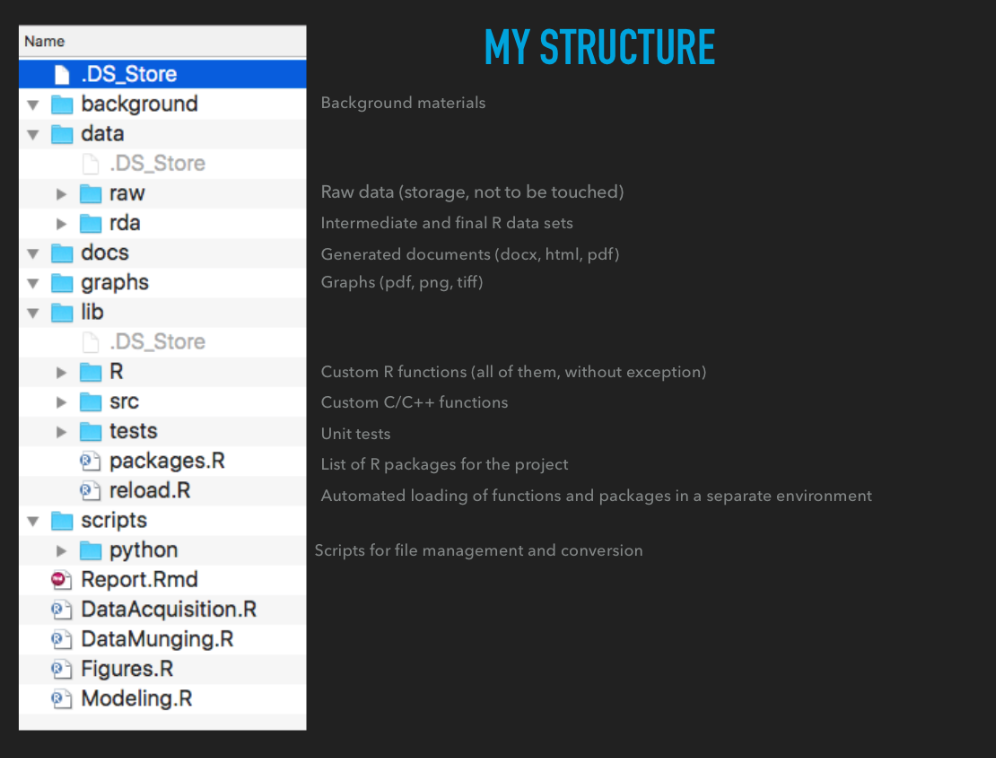

```{r setup, include=FALSE}
knitr::opts_chunk$set(echo = TRUE, 
                      comment = '# ',
                      cache=T,
                      warning=F, message=F)
```

## The data science pipeline

```{r, fig.align='center', fig.height=6, echo=F}
knitr::include_graphics('lecture8_files/0246OS_00_02.png')
```

## Use a template to organize your projects

Before you even get the data

+  Set up a folder structure where
    + you know what goes where
    + you can have canned scripts/packages set things up
+ Make sure it's the same structure every time
+ Next time you visit the project, you don't have to go into desperate search mode

## 


## Storing data

1. Keep one copy of the raw data in the format you received it
2. Read in the data into R (see Lecture 7) -> `DataAcquisition.R` 
3. Save a copy of this data in .RData format (use endings .RData or .rda)

## Start working with the data

Summaries:

+ `summary`
+ `dplyr::summarise`
+ `mean`, `sd`, `range`

Exploratory graphs

+ `ggplot`
+ `plot`

Maybe call this file `DataExploration.R`

## Data munging 

Lectures 6 and 7

+ Reshaping data
+ Aggregating data
+ Split-apply-combine

Maybe call this file `DataMunging.R`

## Modeling

Lectures 4 and 5

+ Hypothesis testing
+ Linear models
+ Logistic regression
+ Whatever model you need to run

This process requires a lot of exploration and trial-and-error, so it gets messy
I'll usually create several files that look at different models, but once I'm done, 
my "final" models go in `Modeling.R`

## Packages to be used

You can use several packages in a particular project

It's good practice to load them first, and know what they are

+ Makes sure packages are installed
+ Makes sure package dependencies are met
+ Makes sure package conflicts are known and fixed

## Packages to be used

```{r packages, echo=T, eval=F}
reqpackages <- c('dplyr', 'reshape2', 'readxl',
                 'ggplot2','stringr','ggthemes')
for(pkg in reqpackages){
  if(!(pkg %in% row.names(installed.packages()))){
    install.packages(pkg, repos='http://cran.r-project.org')
  }
}

library(dplyr)
library(reshape2)
library(readxl)
library(stringr)
library(ggplot2)
library(ggthemes)
```

This goes in `packages.R`

## Creating a pipeline

Now you can ensure that your analyses are reproducible by creating a pipeline where code is run sequentially in a particular order

```{r , echo=T, eval=F}
source('packages.R')
source('DataAcquistion.R')
source('DataExploration.R')
source('DataMunging.R')
source('Modeling.R')
```

Essentially, I'm doing modular programming

+ Separate code by function
+ Makes it easier to debug
+ Try to write code for a particular function once

## Saving your work

You learned last lecture that you can save data in .RData files to be used in R again

Actually, you can save __any__ R object in a .RData file. 

Which means you can save all your intermediate data files and models in R-readable format


## Reporting

R allows you to create automated reports that are reproducible.

The idea is to inter-weave text and R code, and have R replace the code with the results of the code

+ Computer doesn't make mistakes, so no copy-paste errors
+ The same data and code will always create the same document

R's current solution is Rmarkdown

# Live coding and demo