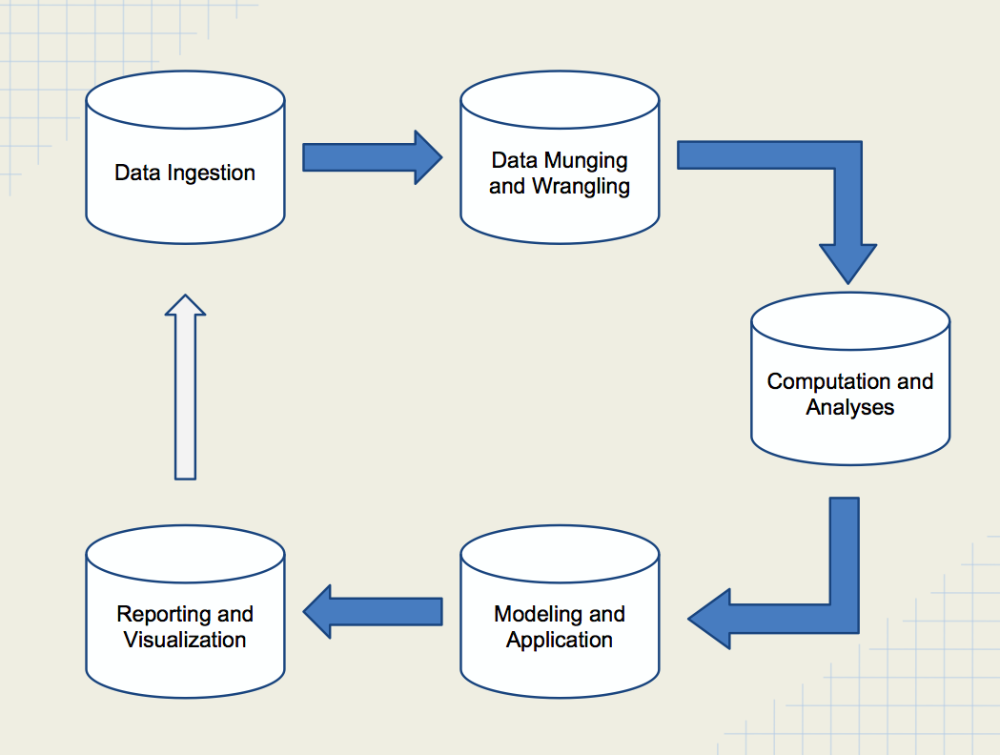

```{r setup, include=FALSE}
knitr::opts_chunk$set(echo = TRUE, 
                      fig.width=4,
                      fig.height=4,
                      comment = '# ',
                      cache=T,
                      warning=F, message=F)
```

## The data science pipeline

```{r, fig.align='center', fig.height=6, echo=F}

```

## The end result of analyses

Usually this is 

+ A report or paper
+ A web page

We would like our results to be __reproducible__

> Reproducible research is the idea that data analyses, and more generally, scientific claims, are published with their data and software code so that others may verify the findings and build upon them. (_Roger Peng, Coursera_)

## The end result of analyses

Why might this be a good idea?

+ You know exactly how the tables, figures and other results were generated
+ No mistakes copying or pasting
+ You can reproduce it at a future date

    - Think review and revision time
    
## Reproducible documents using R

R has always had a method of creating reproducible documents using a package called _Sweave_. This
used $\LaTeX$ for the text portions and R for the computation.

$\LaTeX$ has quite a learning curve, but is really good if you want to maintain style (and if 
the journal provides a $\LaTeX$ style or class file)

Now there's something much simpler: [_Rmarkdown_](http://rmarkdown.rstudio.com)

## Rmarkdown

Rmarkdown allows you to write a document in _markdown_, which is a text markup language that is commonly 
translated into HTML to create web pages. Additionally, it allows you to include R code in the document, 
whose results are processed and included in the document.

The current version of the `rmarkdown` package utilizes the very powerful [pandoc](http://www.pandoc.org)
package, which can translate a markdown document into HTML, PDF (using $\LaTeX$) and MS Word, among other formats. 

So, I write one document in Rmarkdown, which includes text and R code, process it using the `rmarkdown` package, and
produce a HTML page, a MS Word document or a PDF file, as needed. I can also use particular templates so that I can 
have a consistent style for my documents. 

## Rmarkdown

I'll use this [example](lecture7_data/ex1.Rmd) file to demonstrate R markdown


