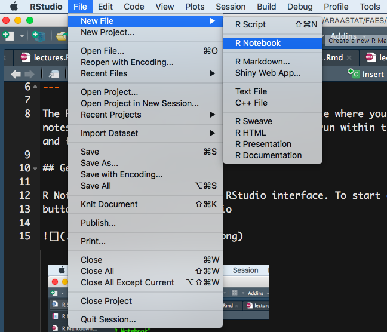

The R Notebook is an example of an R Markdown file where you can keep notes/text and R code together. The code can be run within the Notebook and the output shown on the screen 

## Getting started

R Notebooks are run through the RStudio interface. To start one, use the 
button at the top left of RStudio

or from the menu:

This will open a default R Notebook template:

Feel free to delete all of this and write your own stuff. 

## Using the notebook

You can write text just as you usually would. You can add some formatting to this, like headers, 
bold or italic type, lists and the like using Markdown (See *Help > Markdown Quick Reference* for
a starting point). 

The real power is in being able to add R code and incorporate the results. To do this, you first
have to create an *R chunk*. This is done using the keyboard shortcut *Ctrl+I* (or *Cmd + I* on a Mac), or via the menu (you want the R chunk, not the other languages, for now):

Now, you can keep all code and your notes together in one document. You can transform this document into Word or HTML very easily:

Note that to convert to PDF, you will need additional software called [$\LaTeX$](https://www.latex-project.org/). 

